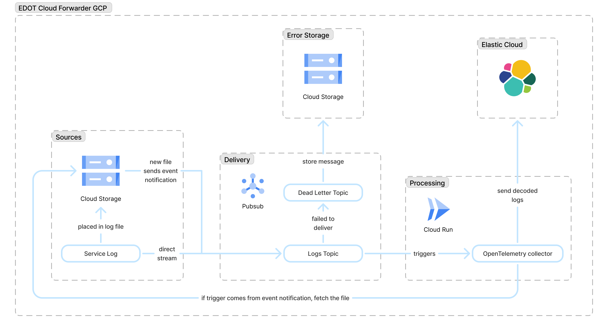

# Terraform Google Elastic Cloud Forwarder

Deploys an Elastic Cloud Forwarder on Google Cloud Platform to automatically stream logs from different sources to Elastic Cloud.

## Architecture

The overall architecture is like this:



The module deploys everything except for the `Elastic Cloud` section, as it expects it to be present already.

## Usage

### Basic Example

```hcl
module "elastic_cloud_forwarder" {
  source = "github.com/elastic/terraform-google-edot-cloud-forwarder?ref=v0.1.1"

  project               = "my-gcp-project"
  region                = "us-central1"
  ecf_exporter_endpoint = "https://my-deployment.es.us-central1.gcp.cloud.es.io:443"
  ecf_exporter_api_key  = var.elastic_api_key
}
```

### Advanced Configuration

```hcl
module "elastic_cloud_forwarder" {
  source = "github.com/elastic/terraform-google-edot-cloud-forwarder?ref=v0.1.1"

  # Required parameters
  project               = "my-gcp-project"
  region                = "us-central1"
  ecf_exporter_endpoint = "https://my-deployment.es.us-central1.gcp.cloud.es.io:443"
  ecf_exporter_api_key  = var.elastic_api_key

  # Optional configuration
  ecf_asset_prefix                    = "production-logs"
  logs_source_bucket_name             = "existing-logs-bucket"
  include_metadata                    = true
  enable_cloud_observability_logging  = true

  # Resource limits
  ecf_container_cpu      = "2"
  ecf_container_memory   = "1Gi"
  max_ecf_instance_count = 50

  # Retry configuration
  retry_minimum_backoff  = 10
  retry_maximum_backoff  = 300
  retry_maximum_attempts = 10

  # Telemetry (optional)
  enable_telemetry = true
  telemetry_endpoint = "https://telemetry.elastic.co"
  telemetry_api_key = var.telemetry_api_key
  telemetry_additional_attributes = {
    environment = "production"
    team        = "platform"
  }
}
```

### Using Existing Resources

```hcl
module "elastic_cloud_forwarder" {
  source = "github.com/elastic/terraform-google-edot-cloud-forwarder?ref=v0.1.1"

  project                     = "my-gcp-project"
  region                      = "us-central1"
  image                       = "gcr.io/my-project/custom-ecf:v1.0.0"
  ecf_exporter_endpoint       = "https://my-deployment.es.us-central1.gcp.cloud.es.io:443"
  ecf_exporter_api_key        = var.elastic_api_key
  logs_source_bucket_name     = "my-existing-logs-bucket"
  force_ecf_artifact_registry = false
}
```

## Prerequisites

- Google Cloud Project with Cloud Run, Pub/Sub, Cloud Storage, Secret Manager, and Artifact Registry APIs enabled.
- Elastic Cloud deployment with API key.

## Submodules

### Artifact Registry

This module includes an `artifact-registry` submodule that creates a private Google Artifact Registry repository for ECF images. For detailed submodule documentation, see [artifact-registry README](./modules/artifact-registry/README.md).

## Technical Reference

The following sections provide detailed technical information about this submodule's requirements, resources, inputs, and outputs.

<!-- BEGIN_TF_DOCS -->
#### Requirements

| Name | Version |
|------|---------|
| <a name="requirement_terraform"></a> [terraform](#requirement_terraform) | >= 1.0.0 |
| <a name="requirement_docker"></a> [docker](#requirement_docker) | >= 3.0 |
| <a name="requirement_google"></a> [google](#requirement_google) | >= 7.0.0 |

#### Providers

| Name | Version |
|------|---------|
| <a name="provider_google"></a> [google](#provider_google) | >= 7.0.0 |

#### Modules

| Name | Source | Version |
|------|--------|---------|
| <a name="module_artifact_registry"></a> [artifact_registry](#module_artifact_registry) | ./modules/artifact-registry | n/a |

#### Resources

| Name | Type |
|------|------|
| [google_cloud_run_v2_service.ecf](https://registry.terraform.io/providers/hashicorp/google/latest/docs/resources/cloud_run_v2_service) | resource |
| [google_cloud_run_v2_service_iam_member.pubsub_permissions](https://registry.terraform.io/providers/hashicorp/google/latest/docs/resources/cloud_run_v2_service_iam_member) | resource |
| [google_project_iam_member.allow_token](https://registry.terraform.io/providers/hashicorp/google/latest/docs/resources/project_iam_member) | resource |
| [google_project_iam_member.cloud_run_permissions](https://registry.terraform.io/providers/hashicorp/google/latest/docs/resources/project_iam_member) | resource |
| [google_pubsub_subscription.dead_letter](https://registry.terraform.io/providers/hashicorp/google/latest/docs/resources/pubsub_subscription) | resource |
| [google_pubsub_subscription.logs](https://registry.terraform.io/providers/hashicorp/google/latest/docs/resources/pubsub_subscription) | resource |
| [google_pubsub_subscription_iam_member.dead_letter_subscriber](https://registry.terraform.io/providers/hashicorp/google/latest/docs/resources/pubsub_subscription_iam_member) | resource |
| [google_pubsub_topic.dead_letter](https://registry.terraform.io/providers/hashicorp/google/latest/docs/resources/pubsub_topic) | resource |
| [google_pubsub_topic.logs](https://registry.terraform.io/providers/hashicorp/google/latest/docs/resources/pubsub_topic) | resource |
| [google_pubsub_topic_iam_member.allow_storage_to_pubsub](https://registry.terraform.io/providers/hashicorp/google/latest/docs/resources/pubsub_topic_iam_member) | resource |
| [google_pubsub_topic_iam_member.dead_letter_publisher](https://registry.terraform.io/providers/hashicorp/google/latest/docs/resources/pubsub_topic_iam_member) | resource |
| [google_secret_manager_secret.exporter_api_key](https://registry.terraform.io/providers/hashicorp/google/latest/docs/resources/secret_manager_secret) | resource |
| [google_secret_manager_secret.telemetry_api_key](https://registry.terraform.io/providers/hashicorp/google/latest/docs/resources/secret_manager_secret) | resource |
| [google_secret_manager_secret_iam_member.exporter_api_key](https://registry.terraform.io/providers/hashicorp/google/latest/docs/resources/secret_manager_secret_iam_member) | resource |
| [google_secret_manager_secret_iam_member.telemetry_api_key](https://registry.terraform.io/providers/hashicorp/google/latest/docs/resources/secret_manager_secret_iam_member) | resource |
| [google_secret_manager_secret_version.exporter_api_key](https://registry.terraform.io/providers/hashicorp/google/latest/docs/resources/secret_manager_secret_version) | resource |
| [google_secret_manager_secret_version.telemetry_api_key](https://registry.terraform.io/providers/hashicorp/google/latest/docs/resources/secret_manager_secret_version) | resource |
| [google_service_account.cloud_run](https://registry.terraform.io/providers/hashicorp/google/latest/docs/resources/service_account) | resource |
| [google_service_account.pubsub](https://registry.terraform.io/providers/hashicorp/google/latest/docs/resources/service_account) | resource |
| [google_storage_bucket.failed_messages](https://registry.terraform.io/providers/hashicorp/google/latest/docs/resources/storage_bucket) | resource |
| [google_storage_bucket.logs](https://registry.terraform.io/providers/hashicorp/google/latest/docs/resources/storage_bucket) | resource |
| [google_storage_bucket_iam_member.cloud_run_permissions](https://registry.terraform.io/providers/hashicorp/google/latest/docs/resources/storage_bucket_iam_member) | resource |
| [google_storage_bucket_iam_member.failed_messages_permissions](https://registry.terraform.io/providers/hashicorp/google/latest/docs/resources/storage_bucket_iam_member) | resource |
| [google_storage_notification.notification](https://registry.terraform.io/providers/hashicorp/google/latest/docs/resources/storage_notification) | resource |
| [google_project.current](https://registry.terraform.io/providers/hashicorp/google/latest/docs/data-sources/project) | data source |
| [google_storage_project_service_account.gcs_account](https://registry.terraform.io/providers/hashicorp/google/latest/docs/data-sources/storage_project_service_account) | data source |

#### Inputs

| Name | Description | Type |
|------|-------------|------|
| <a name="input_dead_letter_to_gcs_interval"></a> [dead_letter_to_gcs_interval](#input_dead_letter_to_gcs_interval) | The maximum interval for flushing a failed message from the dead letter topic to GCS, in seconds. | `number` |
| <a name="input_ecf_asset_prefix"></a> [ecf_asset_prefix](#input_ecf_asset_prefix) | Prefix for the ECF assets' names. Multiple simultaneous deployments should have different prefixes, otherwise, name collisions and associated failures will occur. The prefix must start with a lowercase letter; contain only lowercase letters, numbers, and hyphens; and end with a lowercase letter or number (not a hyphen). | `string` |
| <a name="input_ecf_container_cpu"></a> [ecf_container_cpu](#input_ecf_container_cpu) | ECF Cloud Run container CPU. Check https://cloud.google.com/run/docs/configuring/services/memory-limits#cpu-minimum. | `string` |
| <a name="input_ecf_container_memory"></a> [ecf_container_memory](#input_ecf_container_memory) | ECF Cloud Run container memory. Check https://cloud.google.com/run/docs/configuring/services/memory-limits#cpu-minimum. | `string` |
| <a name="input_ecf_cpu_idle"></a> [ecf_cpu_idle](#input_ecf_cpu_idle) | Determines whether CPU is only allocated during requests. If set to true, billing is request-based, otherwise instance-based.<br/>Request-based billing is recommended when incoming traffic is sporadic, bursty or spiky.<br/>Instance-based billing is recommended when incoming traffic is steady, slowly varying.<br/>See https://docs.cloud.google.com/run/docs/configuring/billing-settings#choosing-traffic. | `bool` |
| <a name="input_ecf_exporter_api_key"></a> [ecf_exporter_api_key](#input_ecf_exporter_api_key) | ECF exporter API key for exporting logs via the Elastic Cloud Forwarder. | `string` |
| <a name="input_ecf_exporter_endpoint"></a> [ecf_exporter_endpoint](#input_ecf_exporter_endpoint) | ECF exporter endpoint. | `string` |
| <a name="input_enable_cloud_observability_logging"></a> [enable_cloud_observability_logging](#input_enable_cloud_observability_logging) | Enable Cloud Run logging to GCP Logs Explorer. When enabled, grants the Cloud Run service account the 'roles/logging.logWriter' role. Note: This increases costs. Disabled by default. | `bool` |
| <a name="input_enable_telemetry"></a> [enable_telemetry](#input_enable_telemetry) | Whether to enable the ECF collector internal telemetry. | `bool` |
| <a name="input_es_mapping_mode"></a> [es_mapping_mode](#input_es_mapping_mode) | Mapping mode to use on the otlphttp exporter. Only used if telemetry endpoint is for elasticsearch. | `string` |
| <a name="input_force_ecf_artifact_registry"></a> [force_ecf_artifact_registry](#input_force_ecf_artifact_registry) | Force the use of the Artifact Registry managed by this module for the ECF image. | `bool` |
| <a name="input_image"></a> [image](#input_image) | The collector image. | `string` |
| <a name="input_include_metadata"></a> [include_metadata](#input_include_metadata) | Whether to add extra metadata to the logs (bucket, object, subscription, message ID, delivery attempt). | `bool` |
| <a name="input_logs_source_bucket_name"></a> [logs_source_bucket_name](#input_logs_source_bucket_name) | The name of the GCS logs source bucket. If not provided, a new one will be created. | `string` |
| <a name="input_max_ecf_instance_count"></a> [max_ecf_instance_count](#input_max_ecf_instance_count) | Maximum number of ECF serving instances. | `number` |
| <a name="input_max_instance_request_concurrency"></a> [max_instance_request_concurrency](#input_max_instance_request_concurrency) | How many concurrent requests the ECF collector can receive. | `number` |
| <a name="input_project"></a> [project](#input_project) | The name of the Google Cloud Platform project in which to create the resources. | `string` |
| <a name="input_region"></a> [region](#input_region) | The Google Cloud Platform region in which to create the resources. | `string` |
| <a name="input_retry_maximum_attempts"></a> [retry_maximum_attempts](#input_retry_maximum_attempts) | The maximum attempts to deliver a given message to ECF collector. | `number` |
| <a name="input_retry_maximum_backoff"></a> [retry_maximum_backoff](#input_retry_maximum_backoff) | The maximum delay between consecutive deliveries of a given message to ECF collector, in seconds. | `number` |
| <a name="input_retry_minimum_backoff"></a> [retry_minimum_backoff](#input_retry_minimum_backoff) | The minimum delay between consecutive deliveries of a given message to ECF collector, in seconds. | `number` |
| <a name="input_telemetry_additional_attributes"></a> [telemetry_additional_attributes](#input_telemetry_additional_attributes) | Additional attributes to add to the ECF collector internal telemetry. | `map(string)` |
| <a name="input_telemetry_api_key"></a> [telemetry_api_key](#input_telemetry_api_key) | API key for the ECF collector internal telemetry endpoint. | `string` |
| <a name="input_telemetry_endpoint"></a> [telemetry_endpoint](#input_telemetry_endpoint) | Endpoint to send the ECF collector internal telemetry to. | `string` |

#### Outputs

| Name | Description |
|------|-------------|
| <a name="output_dead_letter_topic_id"></a> [dead_letter_topic_id](#output_dead_letter_topic_id) | ID of the Pub/Sub dead letter topic. |
| <a name="output_ecf_cloud_run_service_account_email"></a> [ecf_cloud_run_service_account_email](#output_ecf_cloud_run_service_account_email) | Email of the Cloud Run service account. |
| <a name="output_ecf_docker_image_uri"></a> [ecf_docker_image_uri](#output_ecf_docker_image_uri) | URI of the ECF Docker image. |
| <a name="output_ecf_exporter_api_key_secret_id"></a> [ecf_exporter_api_key_secret_id](#output_ecf_exporter_api_key_secret_id) | ECF exporter API key secret ID for exporting logs via the Elastic Cloud Forwarder. |
| <a name="output_ecf_exporter_api_key_version"></a> [ecf_exporter_api_key_version](#output_ecf_exporter_api_key_version) | ECF exporter API key version for exporting logs via the Elastic Cloud Forwarder. |
| <a name="output_ecf_managed_artifact_registry_used"></a> [ecf_managed_artifact_registry_used](#output_ecf_managed_artifact_registry_used) | Whether the ECF Terraform module used its own artifact registry. |
| <a name="output_failed_messages_bucket_name"></a> [failed_messages_bucket_name](#output_failed_messages_bucket_name) | Name of the GCS bucket to which failed messages are sent. |
| <a name="output_google_cloud_run_v2_service_latest_created_revision"></a> [google_cloud_run_v2_service_latest_created_revision](#output_google_cloud_run_v2_service_latest_created_revision) | Revision of the google cloud run service |
| <a name="output_google_cloud_run_v2_service_name"></a> [google_cloud_run_v2_service_name](#output_google_cloud_run_v2_service_name) | Name of the google cloud run service |
| <a name="output_google_cloud_run_v2_service_uri"></a> [google_cloud_run_v2_service_uri](#output_google_cloud_run_v2_service_uri) | URI of the google cloud run service |
| <a name="output_logs_source_bucket_name"></a> [logs_source_bucket_name](#output_logs_source_bucket_name) | Name of the GCS logs source bucket. |
| <a name="output_logs_subscription_id"></a> [logs_subscription_id](#output_logs_subscription_id) | ID of the Pub/Sub subscription for the logs topic. |
| <a name="output_logs_topic_id"></a> [logs_topic_id](#output_logs_topic_id) | ID of the Pub/Sub logs topic. |
| <a name="output_logs_topic_name"></a> [logs_topic_name](#output_logs_topic_name) | Name of the Pub/Sub logs topic. |
| <a name="output_pubsub_google_service_account_email"></a> [pubsub_google_service_account_email](#output_pubsub_google_service_account_email) | Email of the Pub/Sub Google Service Account. |
<!-- END_TF_DOCS -->

## License

This module is licensed under the Elasticsearch License. See [LICENSE](./LICENSE.txt) for details.